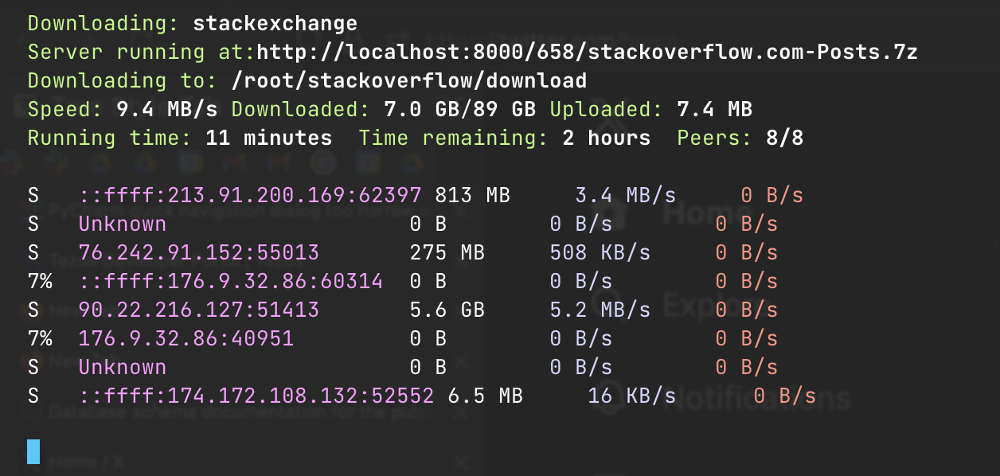

# StackExchange blockchain data exploration scripts

Scripts to explore and plot out data for blockchain developer communities.

- [Original data dumps](https://archive.org/details/stackexchange)
- [Stackoverflow data dump XML to CSV data converter](https://github.com/SkobelevIgor/stackexchange-xml-converter)
- [Stackoverflow stops distributing data dumps](https://meta.stackoverflow.com/a/425121/315168)
- [The fall of StackOverlow](https://observablehq.com/@ayhanfuat/the-fall-of-stack-overflow)  
- This repo uses `git-lfs`

Dataset size is ~40 GB and you are going some ~200 GB free disk space to work on this.
I recommend you work on a remote server using Visual Studio Code remote extensions.

# Usage

First download the data from the archive.

We need

- Posts dataset
- Tags dataset

```shell
wget https://archive.org/download/stackexchange/stackoverflow.com-PostHistory.7z
wget https://archive.org/download/stackexchange/stackoverflow.com-Tags.7z
```

## Creating tag map

First we need to create tag name -> primary key mappings
we can use to navigate the StackOverflow posts dump.

Create tags CSV file we can import to Pandas:

```shell
7z x stackoverflow.com-Tags.7z
./converter --source-path Tags.xml --result-format csv --store-to-dir csv
```

Then we create `tags.json` using our script:

```shell
python blockchain_stackoverflow/tag_map.py 
```

This will create `tags.parquet` and also output post counts for our tags:

```
ethereum with 6681 posts
blockchain with 6637 posts
solidity with 6534 posts
svelte with 4932 posts
hyperledger with 3938 posts
smartcontracts with 2989 posts
web3js with 2333 posts
sveltekit with 1969 posts
bitcoin with 1753 posts
solana with 1211 posts
truffle with 1088 posts
binance with 990 posts
cryptocurrency with 944 posts
ethers.js with 741 posts
nft with 717 posts
hardhat with 665 posts
nearprotocol with 626 posts
web3py with 565 posts
chainlink with 486 posts
uniswap with 238 posts
openzeppelin with 238 posts
binance-smart-chain with 237 posts
brownie with 236 posts
anchor-solana with 193 posts
tron with 175 posts
cosmos with 138 posts
hedera-hashgraph with 109 posts
near with 102 posts
elrond with 94 posts
cardano with 80 posts
cosmos-sdk with 51 posts
matic with 42 posts
avalanche with 32 posts
vyper with 22 posts
ton with 10 posts
web3 with 3 posts
foundry-forge with 2 posts
foundry-rs with 1 posts
```

## Downloading and extracting the full posts dataset

We now need to get all StackOverflow questions to a CSV file.

Download using Bittorrent, and this way you do not die
to the old age waiting for the download to finish.

```shell
cd download
npm install
node_modules/.bin/webtorrent --select stackoverflow.com-Posts.7z stackexchange_archive.torrent 
# 658 = index for Posts.7z
node_modules/.bin/webtorrent --select 658 stackexchange_archive.torrent 
```



And then after two hours:

```shell
7z x download/stackexchange/stackoverflow.com-Posts.7z
./converter --source-path Posts.xml --result-format csv --store-to-dir csv
rm Posts.xml  # Save 95 GB space
ipython create-reduced-dataset.ipynb  # Or run in Visual Studio Code
```

Now we have created [blockchain-posts.parquet](./blockchain-posts.parquet).

## Creating StackOverflow question count baseline 

Because [StackOverflow is in decline]() we need to separate
this StackOverflow's decline from the possible blockchains decline.

For this purpose, we create a time-series that contains monthly
binned question counts of all StackOverflow posts.

We do this with our notebook, which is also going to display 
a graph of the question counts:

```shell
ipython blockchain_stackoverflow/baseline.ipynb
```

## Creating tagged questions only dataset

- Because the full StackOverflow dataset is too large to fit into the RAM,
  we create a smaller dataset that contains data for questions 
  only on our tag list
- We do this by filtering out CSV data chunk by chunk
- We dump the resulting dataset to a Parquest file
- Any further analysis is done on this reduced dataset  

```shell
ipython blockchain_stackoverflow/tag-only-data.ipynb
``